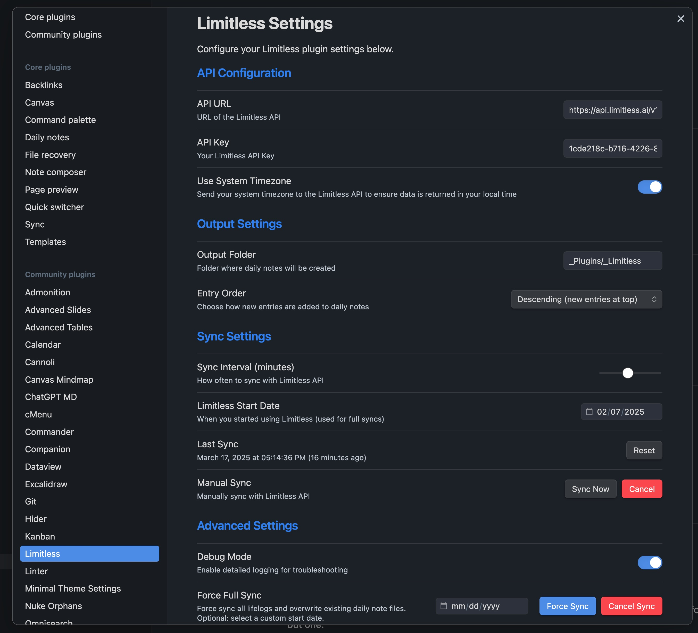

# Limitless for Obsidian

This plugin integrates Obsidian with the Limitless API to create daily notes from your lifelogs. It automatically syncs with the Limitless API at regular intervals and creates or appends to daily notes based on the timestamp of each lifelog entry.

## Features

- **Automatic Syncing**: Syncs with the Limitless API at configurable intervals
- **Daily Notes Integration**: Creates or updates daily notes with your lifelog content
- **Smart Syncing**: Remembers the last sync timestamp to only fetch new entries
- **Non-destructive Updates**: Appends new items to existing notes without overwriting your changes
- **Manual Control**: Provides sync options via ribbon icon and command palette
- **Flexible Configuration**: Customizable API URL, API key, output folder, and sync interval
- **Visual Progress Tracking**: Progress bar shows sync status and completion percentage
- **Cancellable Syncs**: Ability to cancel ongoing sync operations
- **Parallel Processing**: Uses multi-threaded queue system for faster syncing of multiple days
- **Robust Error Handling**: Automatically retries on server errors and implements rate limiting with exponential backoff

## Installation

### From Obsidian Community Plugins
1. In Obsidian, go to Settings > Community plugins
2. Turn off Safe mode
3. Click "Browse" and search for "Limitless"
4. Install the plugin and enable it

### Manual Installation
1. Download the latest release from the GitHub releases page
2. Extract the zip file into your Obsidian vault's `.obsidian/plugins/` folder
3. Restart Obsidian
4. Go to Settings > Community plugins and enable "Limitless"

## Setup

1. After installation, go to Settings > Community plugins
2. Make sure Limitless is enabled
3. Click the gear icon next to Limitless to open its settings
4. Enter your Limitless API URL and API key
5. Set the output folder where daily notes will be created
6. Configure the sync interval (in minutes)
7. Your settings will be automatically saved

## Getting Your Limitless API Key

1. **Access Developer Settings**:
   - Join Limitless if you haven't already
   - Pair your Pendant with your Limitless account
   - Open the [Limitless Web App](https://app.limitless.ai) or Desktop App
   - Look for the Developer link in the navigation menu

2. **Create an API Key**:
   - Once in the Developer section, click the "Create API Key" button in the top right corner
   - Your new API key will be generated and displayed
   - **Important**: Never share your API key, commit it to a source repository, or expose it to third parties

3. **Use Your API Key in Obsidian**:
   - Copy your newly created API key
   - In Obsidian, go to Settings > Community plugins > Limitless > Settings
   - Paste your API key in the "API Key" field
   - The default API URL is `https://api.limitless.ai/v1`

## Usage

### Automatic Syncing
Once configured, the plugin will automatically sync with the Limitless API at the interval you specified. New lifelog entries will be fetched and added to the appropriate daily notes.

### Manual Syncing
You can manually trigger a sync in two ways:
- Click the sync icon in the ribbon (sidebar)
- Use the command palette (Ctrl/Cmd+P) and search for "Limitless: Sync Lifelogs"

### Force Sync
If you need to re-sync all your lifelogs and overwrite existing daily notes:
1. Go to Settings > Community plugins > Limitless > Settings
2. Click the "Force Sync" button
3. Confirm the warning prompt

### Monitoring Sync Progress
During sync operations, a progress bar in the settings tab shows:
- Current sync status
- Percentage completion
- Number of days and entries processed

### Cancelling a Sync
If you need to stop an ongoing sync operation:
1. Go to Settings > Community plugins > Limitless > Settings
2. Click the "Cancel Sync" button
3. The sync will gracefully terminate after completing the current operation

### Parallel Processing
For full syncs or multi-day syncs, the plugin uses a 10-thread queue system with each thread responsible for fetching a day of data. This significantly improves sync performance when processing large amounts of data.

### Daily Notes Format
Each lifelog entry will be added to a daily note with the format `YYYY-MM-DD.md` in your specified output folder. Entries are organized chronologically and formatted as markdown content.

## Troubleshooting

- **No data appearing**: Verify your API key and URL are correct in the settings
- **Sync errors**: Check your internet connection and Limitless API status
- **Missing notes**: Ensure the output folder exists and Obsidian has permission to write to it
- **Sync appears stuck**: Try cancelling the sync and starting again, or check the console for error messages
- **Progress bar not updating**: The progress bar updates every 500ms; for very large syncs, it might appear to move slowly
- **Slow sync performance**: For large data sets, the plugin uses parallel processing, but network conditions and API rate limits can still affect speed
- **API rate limiting**: The plugin automatically handles rate limiting (HTTP 429) with exponential backoff, waiting for the appropriate time before retrying
- **Server errors**: The plugin will automatically retry up to 3 times with increasing delays when encountering server errors (HTTP 5xx)

## Privacy

This plugin only communicates with the Limitless API using the credentials you provide. Your data is not sent anywhere else, and all processing happens locally within Obsidian.

## Support

If you encounter any issues or have feature requests, please submit them on the [GitHub repository](https://github.com/yourusername/obsidian-limitless).

## Changelog

### 1.1.0 (2025-03-17)
- Added visual progress bar for sync operations
- Added ability to cancel ongoing sync operations
- Implemented parallel processing with 10-thread queue system for faster syncing
- Implemented robust HTTP error handling with retries for server errors (5xx)
- Added exponential backoff for rate limiting (429) responses
- Improved error handling and user feedback during sync operations

### 1.0.0 (Initial Release)
- Basic integration with Limitless API
- Automatic and manual syncing options
- Daily notes creation and updating
- Smart syncing with timestamp tracking

